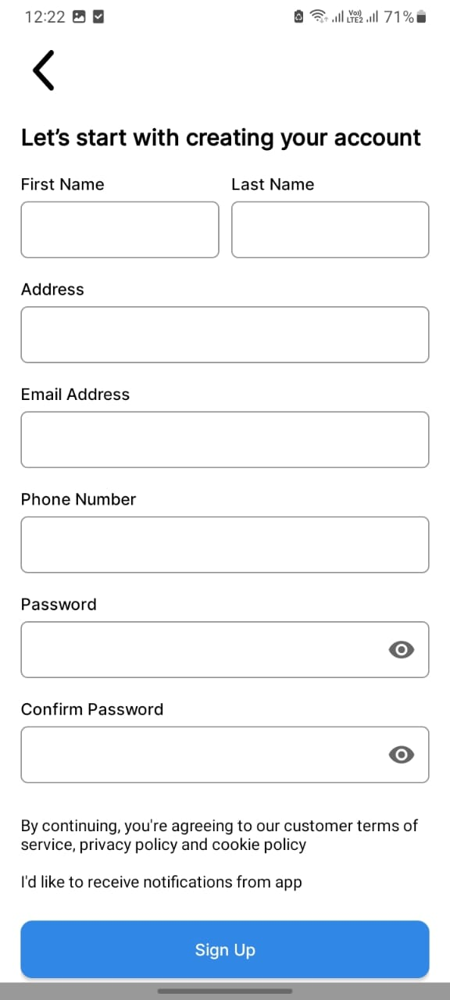
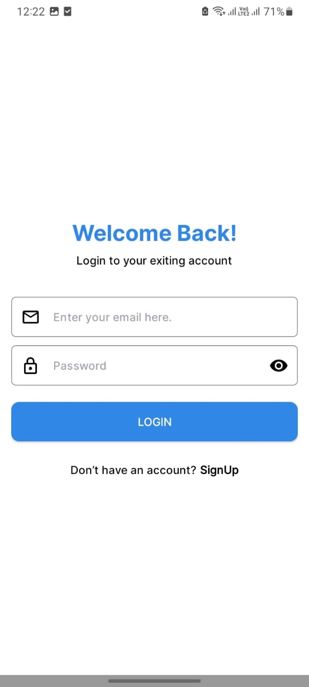
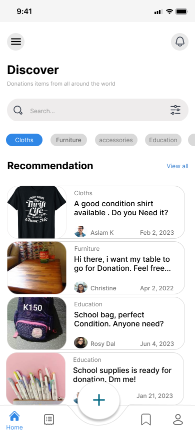
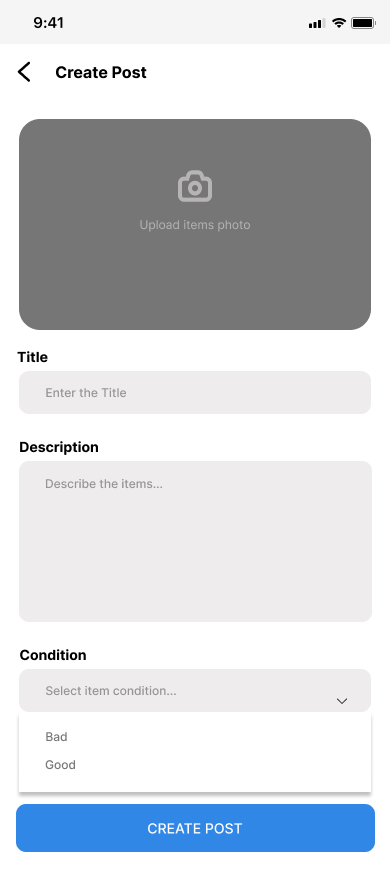
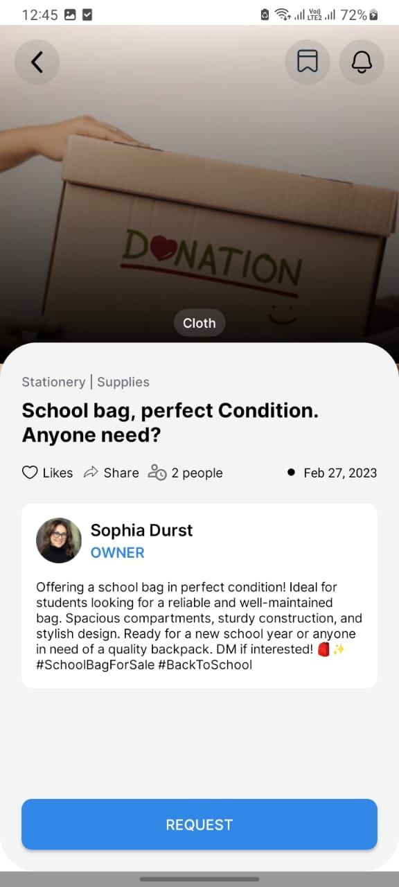

# DonorConnect Android App

DonorConnect is a donation item sharing app designed for Android devices. It facilitates the exchange of items between donors and beneficiaries, aiming to streamline the process of giving and receiving donations. The app leverages modern Android development techniques and adheres to best practices to deliver a seamless user experience.

## Description

DonorConnect simplifies the process of donating items by connecting donors with beneficiaries through a user-friendly mobile interface. Users can log in, register, create posts to offer items for donation, and view posts to find items they need. The app employs contemporary Android development technologies to ensure efficiency, security, and reliability.

## Features

- **User Authentication**: Users can securely log in or register to access the app's features.
- **Create Post**: Donors can create posts to offer items for donation, providing details such as item description, condition, and location.
- **View Posts**: Beneficiaries can browse and search through available donation posts to find items they need.
- **Responsive Design**: The user interface is designed to be intuitive and responsive, providing a seamless experience across various Android devices.

## Installation

To run DonorConnect on your Android device, follow these steps:

1. Clone the repository to your local machine.
2. Open Android Studio and select "Open an existing Android Studio project."
3. Navigate to the cloned repository and select the "DonorConnect" folder.
4. Wait for Android Studio to build the project, then click on the "Run" button to deploy the app on your emulator or connected device.

## Screenshots

## Dependencies

DonorConnect utilizes the following dependencies:

* LiveData: For reactive data observation.
* Coroutine: For asynchronous programming.
* Dependency Injection: Utilized for managing dependencies using Dagger Hilt.
* MVVM Architecture: Followed for clean separation of concerns.
* RESTful APIs: Implemented using Retrofit for efficient communication with the server.
* Retrofit: For type-safe HTTP client.
* Room Database: Used for local data storage and retrieval.

## Contributions

Contributions to DonorConnect are welcome! If you encounter any bugs or issues, please create an issue on GitHub. If you'd like to contribute code, feel free to fork the repository and submit a pull request with your changes.

## License

DonorConnect is licensed under the MIT License. See the LICENSE file for more details.
